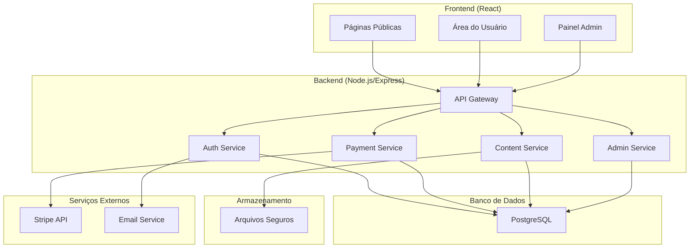
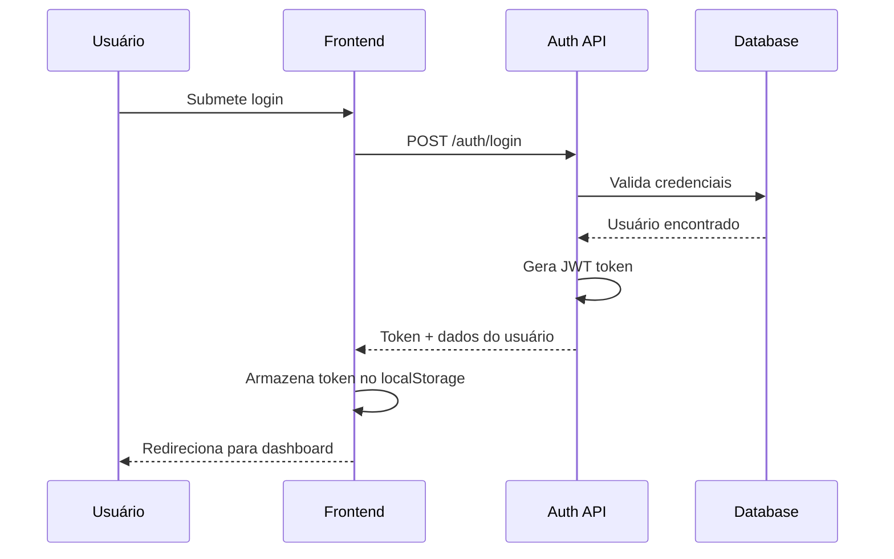
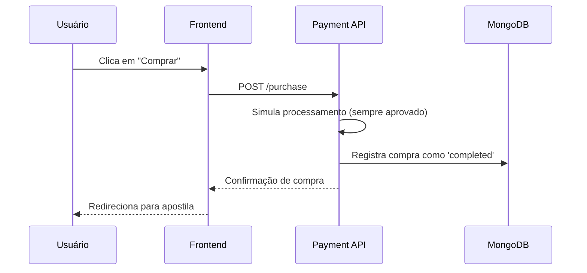

# Documento de Design - Sistema de Apostilas Online

## Visão Geral

O Sistema de Apostilas Online será desenvolvido como uma aplicação web simples com arquitetura de três camadas: frontend (React), backend (Node.js/Express) e banco de dados (MongoDB). A aplicação utilizará sessões simples para autenticação, simulação de pagamento básica, e implementará proteção de conteúdo através de controles de acesso diretos.

## Arquitetura

### Arquitetura Geral do Sistema



### Stack Tecnológico Simplificado

**Frontend:**
- React 18 (JavaScript puro)
- React Router para navegação
- Axios para requisições HTTP
- Bootstrap ou CSS simples para estilização

**Backend:**
- Node.js com Express.js (JavaScript puro)
- express-session para autenticação
- bcrypt para hash de senhas
- multer para upload de arquivos

**Banco de Dados:**
- MongoDB com Mongoose
- Armazenamento local de arquivos

**Ferramentas:**
- Nodemon para desenvolvimento
- Postman para testes de API

## Componentes e Interfaces

### 1. Sistema de Autenticação

**Componentes:**
- `AuthController`: Gerencia login, registro e logout
- `AuthMiddleware`: Valida tokens JWT
- `PasswordService`: Hash e validação de senhas

**Fluxo de Autenticação:**


### 2. Sistema de Pagamentos Simulado

**Componentes:**
- `PaymentController`: Simula processamento de pagamentos
- `PurchaseService`: Gerencia compras

**Fluxo de Compra Simplificado:**


### 3. Sistema de Proteção de Conteúdo

**Componentes:**
- `ContentController`: Serve conteúdo protegido
- `AccessControl`: Verifica permissões
- `FileStreamService`: Stream seguro de arquivos

**Proteção Implementada:**
- URLs temporárias com tokens
- Stream de arquivos sem exposição direta
- Watermark dinâmico com dados do usuário
- Controles JavaScript para prevenir cópia

## Modelos de Dados

### Esquemas MongoDB

```javascript
// Schema de Usuário
const userSchema = {
  _id: ObjectId,
  nome: String,
  email: String, // único
  senha_hash: String, // hash bcrypt
  data_cadastro: Date,
  role: String // 'user' ou 'admin'
}

// Schema de Apostila
const apostilaSchema = {
  _id: ObjectId,
  titulo: String,
  descricao: String,
  arquivo: String,
  preco: Number
}

// Schema de Compra
const purchaseSchema = {
  _id: ObjectId,
  usuario_id: ObjectId, // referência para User
  apostila_id: ObjectId, // referência para Apostila
  data_compra: Date,
  status: String // 'pending', 'completed', 'failed'
}
```

### Relacionamentos

- **User 1:N Purchase**: Um usuário pode ter múltiplas compras
- **Apostila 1:N Purchase**: Uma apostila pode ser comprada por múltiplos usuários
- **User 1:N Session**: Um usuário pode ter múltiplas sessões ativas

## Tratamento de Erros

### Estratégia de Error Handling

**Categorias de Erro:**
1. **Erros de Validação** (400): Dados inválidos do usuário
2. **Erros de Autenticação** (401): Token inválido ou expirado
3. **Erros de Autorização** (403): Acesso negado a recurso
4. **Erros de Recurso** (404): Recurso não encontrado
5. **Erros de Servidor** (500): Falhas internas do sistema

**Implementação:**
```typescript
// Middleware global de tratamento de erros
app.use((error: Error, req: Request, res: Response, next: NextFunction) => {
  if (error instanceof ValidationError) {
    return res.status(400).json({
      error: 'Dados inválidos',
      details: error.details
    });
  }
  
  if (error instanceof AuthenticationError) {
    return res.status(401).json({
      error: 'Token inválido ou expirado'
    });
  }
  
  // Log do erro para monitoramento
  logger.error('Erro interno:', error);
  
  return res.status(500).json({
    error: 'Erro interno do servidor'
  });
});
```

## Estratégia de Testes

### Pirâmide de Testes

**Testes Unitários (70%):**
- Funções de validação
- Serviços de negócio
- Utilitários e helpers
- Componentes React isolados

**Testes de Integração (20%):**
- APIs endpoints
- Integração com banco de dados
- Integração com Stripe
- Fluxos de autenticação

**Testes E2E (10%):**
- Fluxo completo de compra
- Navegação entre páginas
- Cenários críticos de usuário

### Ferramentas de Teste

**Backend:**
- Jest para testes unitários
- Supertest para testes de API
- Testcontainers para testes com banco

**Frontend:**
- Jest + React Testing Library
- Cypress para testes E2E
- MSW para mock de APIs

### Cobertura de Testes

- **Mínimo**: 80% de cobertura de código
- **Crítico**: 95% para funções de pagamento e autenticação
- **Monitoramento**: Relatórios automáticos de cobertura

## Segurança

### Medidas de Segurança Implementadas

**Autenticação e Autorização:**
- JWT com expiração de 24 horas
- Refresh tokens para renovação
- Rate limiting para APIs sensíveis
- Validação rigorosa de permissões

**Proteção de Dados:**
- Hash bcrypt com salt para senhas
- Sanitização de inputs
- Validação de tipos com Joi/Zod
- Headers de segurança com Helmet

**Proteção de Conteúdo:**
- URLs temporárias com tokens únicos
- Stream de arquivos sem cache
- Watermark dinâmico
- Controles anti-cópia no frontend

**Monitoramento:**
- Logs de tentativas de acesso
- Alertas para atividades suspeitas
- Backup automático de dados críticos

## Performance

### Otimizações Implementadas

**Frontend:**
- Code splitting por rotas
- Lazy loading de componentes
- Otimização de imagens
- Cache de dados com React Query

**Backend:**
- Cache Redis para sessões
- Índices otimizados no banco
- Compressão gzip
- Pool de conexões do banco

**Infraestrutura:**
- CDN para assets estáticos
- Load balancer para múltiplas instâncias
- Monitoramento de performance
- Auto-scaling baseado em demanda

### Métricas de Performance

- **Tempo de carregamento**: < 3 segundos
- **Time to Interactive**: < 5 segundos
- **API Response Time**: < 500ms (95th percentile)
- **Disponibilidade**: 99.9% uptime